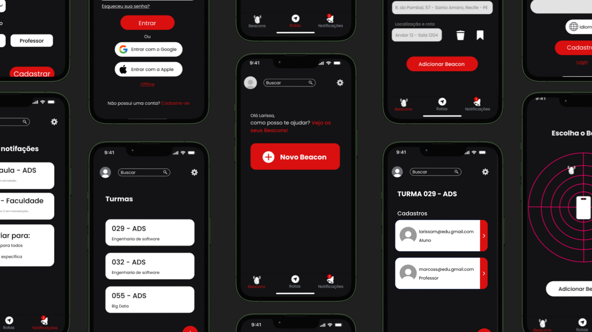
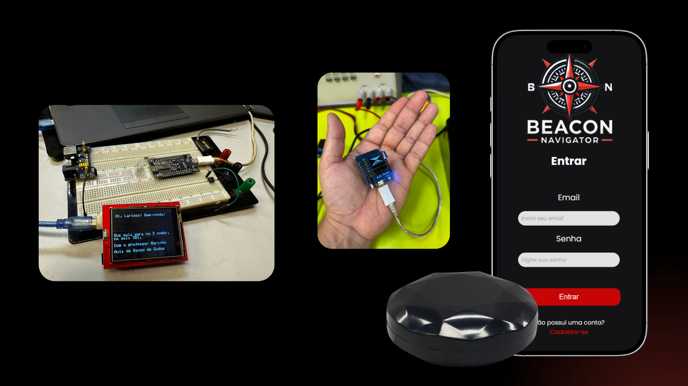

# FRONT-BEACON-NAVIGATOR

O Beacon Navigator é um dispositivo vestível inovador que promove a inclusão e autonomia de pessoas com deficiência auditiva. Utilizando tecnologias como Bluetooth, GPS e beacons, facilita a navegação em ambientes complexos por meio de uma interface visual intuitiva e conectividade com aplicativo móvel.

## Figma e imagens do hardware

### Link do Figma: https://www.figma.com/design/vujOFGPnaUHhwUeYWsvnhI/beacon?node-id=0-1&t=KRALwjhg2v6r6Ixn-1 
 
 

